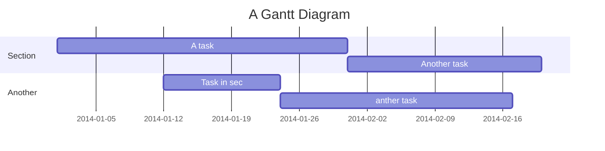

Covid-Taichung.com 
===

## What We Do

[Covid-Taichung.com](https://covid-taichung.com) is a volunteer, not-for-profit project with a mission to serve an English speaking public with the most up-to-date, reliable information on how Covid impacts our lives daily in this city.
The core offerings of our project revolve around maps, FAQs/guides, and statistics, all rigorously maintained with the most accurate and official information.

### Maps

A comprehensive set of maps cataloging:
- vaccination sites,
- footprints of confirmed Covid cases, and 
- disinfection sites, 
in Taichung.

### FAQs/guides


### Stats


## Volunteers

You too can contribute to the project.
As of early August, the team's comprised of just over a dozen people contributing in a variety of ways like:
- getting the latest information from official government publications,
- confirming and clarifying this information directly with officials,
- cleaning up messy geographic data,
- translating,
- organizing, writing up, and editing this information into shorter summaries, and longer step-by-step guides,
- researching the needs of our target audience and the behavior of the users on our site,
- designing and coding the most effective web experience we can to best inform the public on latest developments, and 
- spreading the word through social media and public relations.

If you think you can join our effort, please contact us to introduce yourself and tell us how you think you could assist the effort. 


---

the rest of this README is a template provided by a text editor and is only temporarily retained here for reference while work is in progress here.


---

This README


## Table of Contents

[TOC]

## Beginners Guide

If you are a total beginner to this, start here!

1. Visit hackmd.io
2. Click "Sign in"
3. Choose a way to sign in
4. Start writing note!

User story
---

```gherkin=
Feature: Guess the word

  # The first example has two steps
  Scenario: Maker starts a game
    When the Maker starts a game
    Then the Maker waits for a Breaker to join

  # The second example has three steps
  Scenario: Breaker joins a game
    Given the Maker has started a game with the word "silky"
    When the Breaker joins the Maker's game
    Then the Breaker must guess a word with 5 characters
```
> I choose a lazy person to do a hard job. Because a lazy person will find an easy way to do it. [name=Bill Gates]


```gherkin=
Feature: Shopping Cart
  As a Shopper
  I want to put items in my shopping cart
  Because I want to manage items before I check out

  Scenario: User adds item to cart
    Given I'm a logged-in User
    When I go to the Item page
    And I click "Add item to cart"
    Then the quantity of items in my cart should go up
    And my subtotal should increment
    And the warehouse inventory should decrement
```

> Read more about Gherkin here: https://docs.cucumber.io/gherkin/reference/

User flows
---
```sequence
Alice->Bob: Hello Bob, how are you?
Note right of Bob: Bob thinks
Bob-->Alice: I am good thanks!
Note left of Alice: Alice responds
Alice->Bob: Where have you been?
```

> Read more about sequence-diagrams here: http://bramp.github.io/js-sequence-diagrams/

Project Timeline
---


> Read more about mermaid here: http://mermaid-js.github.io/mermaid/

## Appendix and FAQ

:::info
**Find this document incomplete?** Leave a comment!
:::

###### tags: `Templates` `Documentation`
